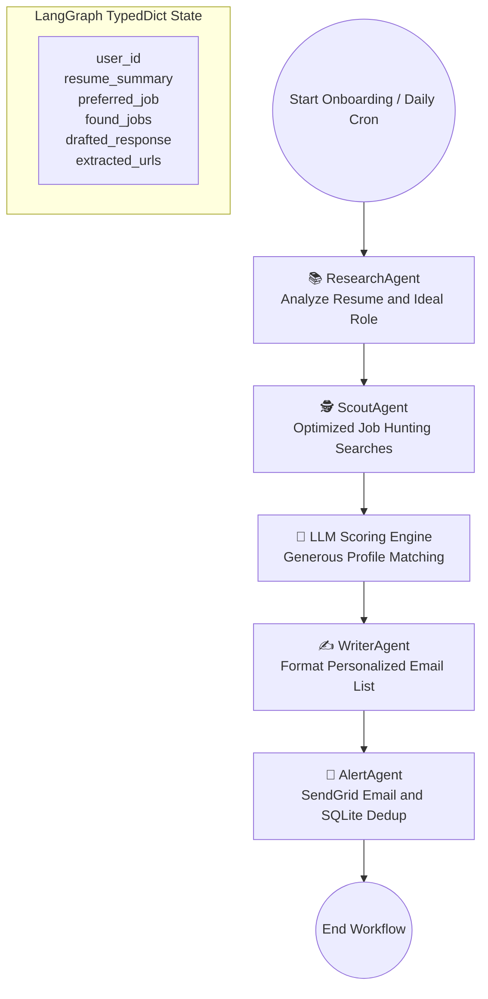
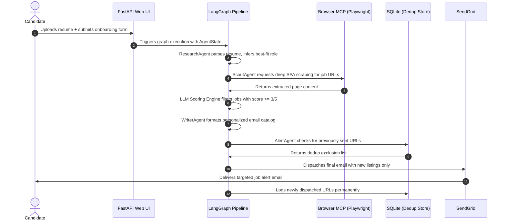

# 🚀 Career-Pilot

[](https://huggingface.co/spaces/Vishnuporkulath/career-pilot)
[](https://www.python.org/)
[](https://langchain-ai.github.io/langgraph/)
[](https://fastapi.tiangolo.com/)
[](https://opensource.org/licenses/MIT)

> **Career-Pilot** is an agentic, stateful ecosystem built on **LangGraph** and the **Model Context Protocol (MCP)** to bridge the "Context Gap" in technical job hunting. Instead of sending low-quality bulk applications, Career-Pilot focuses on **High-Intent Alignment**: discovering targeted technical roles, performing deep semantic matching against a candidate's resume, drafting personalized job listings, and alerting the candidate directly via email with precise application targets.

---

## 🚀 Key Value Proposition & Architecture Overview

Modern job hunting is bottlenecked by generic, high-volume applications that rarely convert. **Career-Pilot** bridges this gap:

- **High-Intent Targeting** — Discovers technical roles semantically aligned to the candidate's actual skills, not just keyword matches.
- **Autonomous Pipeline** — Four specialized LangGraph agents run sequentially from resume parsing to email delivery with no manual steps.
- **Serverless Scraping** — A custom FastMCP browser server runs headless Playwright client-side, bypassing SPA rendering traps without exposing infrastructure.

---

## 🤖 Agent Pipeline & State Machine

Career-Pilot orchestrates four distinct specialized agents within a stateful, cyclic workflow built on LangGraph:



### Agent Responsibilities

| Agent | Role | Key Output |
| :--- | :--- | :--- |
| **📚 Research Agent** | Parses uploaded resume to extract a structured technical DNA report — core stacks, years of experience, location constraints, and best-fit role inference | `resume_summary`, `preferred_job` |
| **🕵️ Scout Agent** | Generates multi-variant search queries against LinkedIn, Indeed, Naukri, and WeWorkRemotely; filters aggregator URLs; runs headless Playwright scraping via FastMCP | `found_jobs` (raw candidates) |
| **🧠 LLM Scoring Engine** | Scores each job out of 5 across role title, location, experience level, education, and skill overlap; retains listings scoring ≥ 3/5 | `found_jobs` (filtered) |
| **✍️ Writer Agent** | Maps job relevance to resume history; tags listings with source platform markers (📍 via LinkedIn, 📍 via Indeed); builds a high-impact bulleted catalog | `drafted_response` |
| **🚨 Alert Agent** | Delivers the formatted catalog via SendGrid; permanently indexes dispatched URLs in SQLite to prevent repeat alerts | Email sent + `extracted_urls` logged |

---

## 🛠️ System Architecture & Data Flow

GestureLearn uses a decoupled, modular design divided into a **FastAPI server** (orchestrator + web UI) and a **LangGraph pipeline** (inference and agent execution engine).



---

## 📂 Project Structure

```
.
├── main.py                    # LangGraph compiler — defines state graph and execution edges
├── api.py                     # FastAPI router — onboarding endpoint, static views, APScheduler cron
├── agents/
│   ├── state.py               # AgentState TypedDict (user params, scraped jobs, output emails)
│   ├── config.py              # LLM client bootstrap with dynamic quota-based switchover
│   ├── research_agent.py      # research_node — extracts technical credentials from resumes
│   ├── scout_agent.py         # scout_node — Serper.dev searches, filtering, and LLM matching
│   ├── writer_agent.py        # writer_node — structures job matches into personalized pitch
│   └── alert_agent.py         # alert_node — SendGrid email delivery + SQLite URL logging
├── mcp_servers/
│   └── browser_mcp.py         # FastMCP server running headless Playwright for SPA scraping
└── db/
    └── database.py            # SQL schema setup, user insertions, job logs, deduplication
```

---

## 📦 Local Installation & Configuration

### Prerequisites

- [Python 3.11+](https://www.python.org/)
- [Node.js](https://nodejs.org/) (for custom MCP integrations)
- [Playwright](https://playwright.dev/) browsers

### 1. Clone & Set Up

```bash
git clone https://github.com/vishnup102002/Career-Pilot.git
cd Career-Pilot
python -m venv venv
source venv/bin/activate
pip install -r requirements.txt
playwright install chromium --with-deps
```

### 2. Configure Environment Variables

Create a `.env` file in the root directory:

```env
# LLM Configuration
GOOGLE_API_KEY=your_gemini_api_key_here
GROQ_API_KEY=your_groq_api_key_here
USE_GEMINI=true   # Set to true to prioritize Gemini over Groq

# Search Engine
SERPER_API_KEY=your_serper_dev_api_key_here

# Email Delivery
SENDGRID_API_KEY=your_sendgrid_api_key_here
EMAIL_SENDER=sender_verified_email@domain.com
```

### 3. Initialize SQLite Schema

```bash
python db/database.py
```

### 4. Start the Application

```bash
python api.py
```

Open your browser to `http://127.0.0.1:8000` to access the onboarding page.

---

## 🌎 Production Deployment & Hosting

### Deploying to Hugging Face Spaces (Docker SDK)

1. Configure your Space to use the **Docker SDK**.
2. The custom `Dockerfile` handles the Python 3.11 environment, installs OS dependencies for Chromium, downloads Playwright runtimes, and launches Uvicorn on port `7860`.
3. Add the environment secrets inside the Space settings console:

| Secret Key | Description |
|---|---|
| `GOOGLE_API_KEY` | Gemini API access |
| `GROQ_API_KEY` | Groq LLM fallback |
| `SERPER_API_KEY` | Google Serper.dev job search |
| `SENDGRID_API_KEY` | Email delivery |
| `EMAIL_SENDER` | Verified sender address |

---

## 💻 Tech Stack & Open Source Ecosystem

| Layer | Technology |
|---|---|
| **Stateful Orchestration** | LangGraph — dynamic multi-agent node transitions and memory preservation |
| **Protocol Standard** | Model Context Protocol (MCP) via `fastmcp` — tool-calling agents with browser runtimes |
| **LLM Backends** | Google Gemini (`gemini-2.0-flash`) + Groq (`llama-3.1-8b-instant`) with quota-based switchover |
| **Database Layer** | Native SQLite (`data/career_pilot.db`) — user metadata and URL deduplication |
| **Search Engine** | Serper.dev — Google Search API for organic job listing retrieval |
| **Web Scraping** | Playwright (headless Chromium) via FastMCP — SPA-safe deep page extraction |
| **Email Delivery** | SendGrid — transactional email dispatch with delivery tracking |
| **Web UI** | FastAPI + HTML5 + Vanilla CSS — glassmorphic onboarding dashboard |

---

## 🔒 Security & Privacy Policy

- Candidate resume data is processed **in-memory only** and never persisted beyond the active pipeline run.
- All job URL deduplication is stored locally in **SQLite on-instance** — no third-party data sharing.
- Email dispatch uses **SendGrid's HTTPS API** exclusively; no plaintext credential transmission occurs.

---

## 📈 Future Roadmap

- [ ] **Interactive Mock Interviews** — Generate tailored technical questions based on the candidate's exact target roles.
- [ ] **Salary Intelligence** — Integrate real-time market data to recommend optimum salary ranges during job selection.
- [ ] **Cross-Platform HITL Approvals** — Support WhatsApp/Telegram callbacks to approve and edit drafts directly from chat.

---

## 📜 License

Licensed under the [MIT License](LICENSE). Created by **Vishnu P**.
