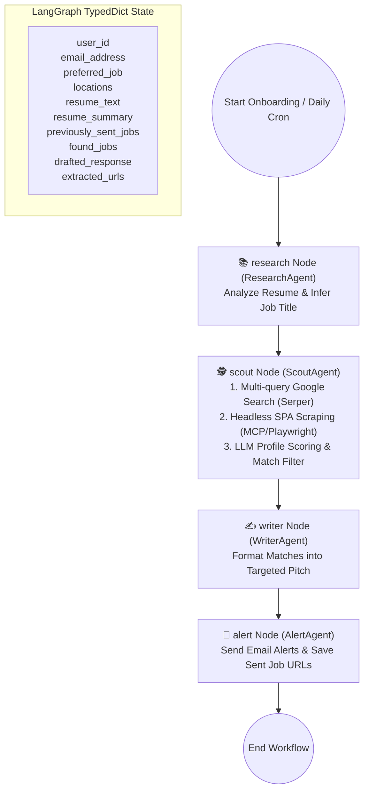
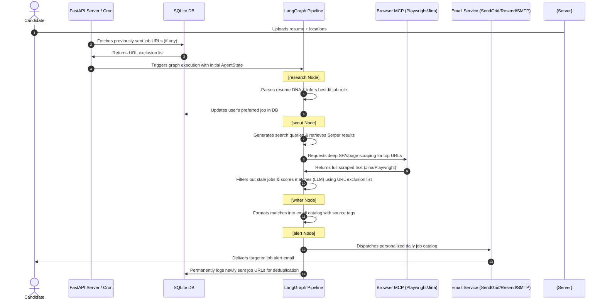

# 🚀 Career-Pilot

[](https://huggingface.co/spaces/Vishnuporkulath/career-pilot)
[](https://www.python.org/)
[](https://langchain-ai.github.io/langgraph/)
[](https://fastapi.tiangolo.com/)
[](https://opensource.org/licenses/MIT)

> **Career-Pilot** is an agentic, stateful ecosystem built on **LangGraph** and the **Model Context Protocol (MCP)** to bridge the "Context Gap" in technical job hunting. Instead of sending low-quality bulk applications, Career-Pilot focuses on **High-Intent Alignment**: discovering targeted technical roles, performing deep semantic matching against a candidate's resume, drafting personalized job listings, and alerting the candidate directly via email with precise application targets.

---

## 🚀 Key Value Proposition & Architecture Overview

Modern job hunting is bottlenecked by generic, high-volume applications that rarely convert. **Career-Pilot** bridges this gap:

- **High-Intent Targeting** — Discovers technical roles semantically aligned to the candidate's actual skills, not just keyword matches.
- **Autonomous Pipeline** — Four specialized LangGraph nodes run sequentially from resume parsing to email delivery with no manual steps.
- **Serverless Scraping** — A custom FastMCP browser server runs headless Playwright or premium Apify/Jina services client-side, bypassing SPA rendering traps without exposing infrastructure.

---

## 🤖 Agent Pipeline & State Machine

Career-Pilot orchestrates four distinct specialized agents within a stateful, cyclic workflow built on LangGraph:



### Agent Responsibilities

| Agent / Node | Role | Key Output / Action |
| :--- | :--- | :--- |
| **📚 Research Agent** (`research`) | Parses uploaded resume to extract a structured technical DNA report — core stacks, years of experience, location constraints, and best-fit role inference. Updates the user's inferred job role in SQLite database. | `resume_summary`, `preferred_job` |
| **🕵️ Scout Agent** (`scout`) | Generates multi-variant search queries against LinkedIn, Indeed, Naukri, and WeWorkRemotely; filters aggregator URLs; cleans markdown boilerplate; extracts experience requirements; pre-filters experience mismatches; runs headless Playwright scraping via FastMCP (with premium Jina/Apify options); and scores listings (score ≥ 3/5). | `found_jobs` (filtered match text), `extracted_urls` |
| **✍️ Writer Agent** (`writer`) | Maps job relevance to resume history; tags listings with source platform markers (📍 via LinkedIn, 📍 via Indeed); builds a high-impact bulleted catalog. | `drafted_response` |
| **🚨 Alert Agent** (`alert`) | Delivers the formatted catalog via SendGrid, Resend, or Gmail SMTP; permanently indexes dispatched URLs in SQLite on success to prevent duplicate alerts. | Email sent + `extracted_urls` logged in DB |

---

## 🛠️ System Architecture & Data Flow

Career-Pilot uses a decoupled, modular design divided into a **FastAPI server** (orchestrator + web UI) and a **LangGraph pipeline** (inference and agent execution engine).



---

## 📂 Project Structure

```
.
├── main.py                    # LangGraph compiler — defines state graph and execution edges
├── api.py                     # FastAPI router — onboarding endpoint, static views, APScheduler cron
├── keep_alive.py              # Hugging Face Space Keep-Alive background utility
├── Dockerfile                 # Docker configuration for Hugging Face Spaces deployment
├── Procfile                   # Process file for Heroku/Render deployment
├── nixpacks.toml              # Nixpacks build configuration
├── requirements.txt           # Python project dependencies
├── agents/
│   ├── state.py               # AgentState TypedDict (user params, scraped jobs, output emails)
│   ├── config.py              # LLM client bootstrap with dynamic quota-based switchover
│   ├── research_agent.py      # research_node — extracts credentials & infers job role from resume
│   ├── scout_agent.py         # scout_node — query builder, Serper search, MCP scraper, boilerplate cleaning, LLM scoring
│   ├── writer_agent.py        # writer_node — structures job matches into personalized catalog
│   └── alert_agent.py         # alert_node — email dispatch (SendGrid / Resend / Gmail SMTP) + DB logger
├── mcp_servers/
│   └── browser_mcp.py         # FastMCP Server providing Playwright, Jina Reader & Apify batch scrapers
├── db/
│   └── database.py            # SQLite schema configuration, user management, and URL logging
├── evaluation/
│   ├── test_cases.json        # Mock scenarios for testing the matching engine
│   ├── eval_harness.py        # LLM-as-a-Judge benchmark scoring script
│   └── eval_report.md         # Generated benchmark evaluation results
├── static/
│   ├── index.html             # Glassmorphic onboarding page front-end
│   ├── app.js                 # Tag inputs, city autocomplete, and AJAX handler
│   ├── style.css              # Custom responsive glassmorphism styles and animations
│   ├── robots.txt             # Search engine crawler instructions
│   └── sitemap.xml            # Sitemap for SEO indexing
└── .github/
    └── workflows/
        └── keep_alive.yml     # GitHub Action scheduling keep-alive pings
```

---

## 📦 Local Installation & Configuration

### Prerequisites

- [Python 3.11+](https://www.python.org/)
- [Node.js](https://nodejs.org/) (for custom MCP integrations)
- [Playwright](https://playwright.dev/) browsers

### 1. Clone & Set Up

```bash
git clone https://github.com/vishnup102002/Career-Pilot.git
cd Career-Pilot
python -m venv venv
source venv/bin/activate
pip install -r requirements.txt
playwright install chromium --with-deps
```

### 2. Configure Environment Variables

Copy the provided secure environment template to `.env` and fill in your keys:

```bash
cp .env.example .env
```

### Environment Variables Details

| Variable | Required / Optional | Description |
|---|---|---|
| `GOOGLE_API_KEY` | Required (if `USE_GEMINI=true`) | Gemini API access key. Used for `gemini-2.0-flash`. |
| `GROQ_API_KEY` | Required (if no Gemini key) | Groq API access key. Falls back to `llama-3.1-8b-instant`. |
| `USE_GEMINI` | Optional (Default: `false`) | Prioritizes Gemini over Groq for processing when set to `true`. |
| `SERPER_API_KEY` | **Required** | Google Serper.dev API key to fetch organic Google search results. |
| `SENDGRID_API_KEY` | Optional | Transactional email delivery API key. |
| `EMAIL_SENDER` | Optional | Verified sender address for SendGrid/Gmail SMTP. |
| `RESEND_API_KEY` | Optional | Transactional email delivery key via Resend. |
| `EMAIL_PASSWORD` | Optional | App password generated for Gmail SMTP email dispatch (Local only). |
| `APIFY_API_TOKEN` | Optional | Apify token to use their premium RAG web browser actor for headless scraping. |
| `JINA_API_KEY` | Optional | Jina Reader token to speed up and authenticate web parsing. |

### 3. Initialize SQLite Schema

```bash
python db/database.py
```

### 4. Start the Application

```bash
python api.py
```

Open your browser to `http://127.0.0.1:8000` to access the onboarding page.

---

## 🏥 Production Health Check & Monitoring

Career-Pilot includes a production-grade diagnostic endpoint:
- **`GET /api/health`**: Returns real-time JSON report detailing system uptime, SQLite statistics (total users, logged emails), LLM connectivity status, and third-party environment credentials presence. Extremely useful for hosting platforms like Hugging Face Spaces or Uptime Kuma monitors.

---

## 🌎 Production Deployment & Hosting

### Deploying to Hugging Face Spaces (Docker SDK)

1. Configure your Space to use the **Docker SDK**.
2. The custom `Dockerfile` handles the Python 3.11 environment, installs OS dependencies for Chromium, downloads Playwright runtimes, and launches Uvicorn on port `7860`.
3. Add the environment secrets inside the Space settings console.
4. **Persistent Database Storage**: SQLite database persistent storage is fully supported on Hugging Face Spaces. Create a persistent storage mount at `/data` in Space Settings (Storage Buckets), or pass the path via `HF_BUCKET_PATH` env var to prevent data loss when the space restarts.

---

## 📡 Hugging Face Space Keep-Alive Utility

Since free Hugging Face Spaces go to sleep automatically after periods of inactivity (which pauses all internal schedulers/cron jobs), we provide a dedicated utility to keep the Space active or wake it up before the daily search cron triggers at 9:00 AM IST.

### Local Daemon Mode
You can run the keep-alive script locally as a daemon in the background:
```bash
# Ping the space every 30 minutes to prevent it from sleeping
python keep_alive.py --url https://your-space-name.hf.space --daemon --interval 30

# Alternatively, schedule it to run once every morning at 08:45 AM IST (to wake up the space for the 9:00 AM cron)
python keep_alive.py --url https://your-space-name.hf.space --daemon --morning-only
```

### GitHub Actions Workflow (Serverless / Recommended)
We have configured a GitHub Actions workflow in `.github/workflows/keep_alive.yml`. This workflow runs:
1. Every 6 hours to prevent the Hugging Face Space from entering deep sleep.
2. Specifically at 03:15 UTC (08:45 AM IST) to wake the Space up right before the morning cron triggers.

**Setup**:
1. Push this repository to GitHub.
2. Add your space direct URL (e.g. `https://vishnuporkulath-career-pilot.hf.space`) as a GitHub Repository Secret named `APP_URL`.

---

## 🧪 Quality Assurance, Tracing & Evaluation

### 1. LangSmith Integration (Automatic Agent Tracing)
Since `langsmith` is included in our dependencies and Career-Pilot uses standard LangChain/LangGraph model components, you can enable comprehensive state graph tracing simply by adding the following to your `.env` file:
```ini
LANGCHAIN_TRACING_V2=true
LANGCHAIN_ENDPOINT="https://api.smith.langchain.com"
LANGCHAIN_API_KEY="your-langsmith-api-key-here"
LANGCHAIN_PROJECT="career-pilot"
```

### 2. End-to-End Test Suite
We have implemented a comprehensive 81-test E2E test suite covering unit level, integration flows, SQLite database managers, safety controls (preventing email HTML injections), experience mismatch pre-filtering, and FastAPI routing.

To run the automated tests:
```bash
python -m pytest tests/ -v
```

To run with coverage reporting:
```bash
python -m pytest tests/ -v --cov=. --cov-report=term-missing
```

### 3. LLM-as-a-Judge Evaluation Suite
We have implemented a custom benchmark evaluation harness located under the `evaluation/` directory. It uses mock candidate scenarios and job postings to evaluate the scout matching agent's performance.

To run the evaluation:
```bash
python evaluation/eval_harness.py
```

The script will:
- Run the agent's matching algorithm on scenarios in `evaluation/test_cases.json`.
- Compute performance metrics: **Accuracy, Precision, Recall, and F1-Score**.
- Run an independent **LLM-as-a-Judge** to evaluate the factual correctness and quality of the agent's matching reasoning (scored 1-5).
- Print a diagnostic summary and save a markdown report to `evaluation/eval_report.md`.


---

## 📈 Future Roadmap

- [ ] **Interactive Mock Interviews** — Generate tailored technical questions based on the candidate's exact target roles.
- [ ] **Salary Intelligence** — Integrate real-time market data to recommend optimum salary ranges during job selection.
- [ ] **Cross-Platform HITL Approvals** — Support WhatsApp/Telegram callbacks to approve and edit drafts directly from chat.

---

## 📜 License

Licensed under the [MIT License](LICENSE). Created by **Vishnu P**.
