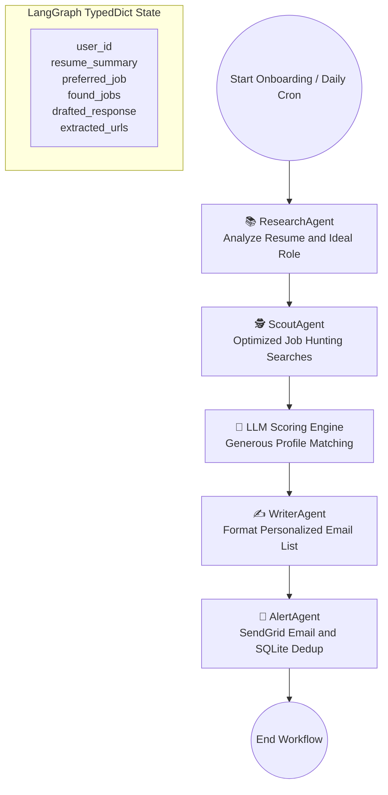

# Career-Pilot: Autonomous MCP & LangGraph Driven Job Intelligence Engine

[](https://huggingface.co/spaces/Vishnuporkulath/career-pilot) [](https://www.python.org/) [](https://opensource.org/licenses/MIT)

Career-Pilot is an agentic, stateful ecosystem built on **LangGraph** and the **Model Context Protocol (MCP)** to bridge the "Context Gap" in technical job hunting. Instead of sending low-quality bulk applications, Career-Pilot focuses on **High-Intent Alignment**: discovering targeted technical roles, performing deep semantic matching against a candidate's resume, drafting personalized job listings, and alerting the candidate directly via email with precise application targets.

The live application is hosted on Hugging Face Spaces: [[Career-Pilot Live App](https://huggingface.co/spaces/Vishnuporkulath/career-pilot)]
---

## 🗺️ System Architecture & Workflow

Career-Pilot orchestrates four distinct specialized agents within a stateful, cyclic workflow built on LangGraph. Here is the operational state graph:



---

## 🛠️ Tech Stack & Key Files

### Core Technologies

| Layer | Technology |
|---|---|
| **Stateful Orchestration** | LangGraph — Dynamic multi-agent node transition and memory preservation |
| **Protocol Standard** | Model Context Protocol (MCP) via `fastmcp` to interface tool-calling agents with browser runtimes |
| **LLM Backends** | Dual client support: Google Gemini (`gemini-2.0-flash`) and Groq (`llama-3.1-8b-instant`) |
| **Database Layer** | Native SQLite (`data/career_pilot.db`) to track user metadata and deduplicate sent listings |
| **Web UI** | Glassmorphic dashboard built with FastAPI, HTML5, Vanilla CSS, and custom async JS |

### Workspace Directory Structure

```
main.py           # LangGraph compiler — defines state graph and sequential execution edges
api.py            # FastAPI router — onboarding endpoint, static views, APScheduler cron job

agents/
├── state.py          # AgentState TypedDict (user params, scraped jobs, output emails)
├── config.py         # LLM client bootstrap with dynamic quota-based switchover
├── research_agent.py # research_node — extracts technical credentials from resumes
├── scout_agent.py    # scout_node — Serper.dev searches, filtering, and LLM matching
├── writer_agent.py   # writer_node — structures job matches into personalized pitch
└── alert_agent.py    # alert_node — SendGrid email delivery + SQLite URL logging

mcp_servers/
└── browser_mcp.py    # FastMCP server running headless Playwright for SPA scraping

db/
└── database.py       # SQL schema setup, user insertions, job logs, deduplication
```

---

## 🤖 Dynamic Agent Pipeline

### 1. The Research Agent

Reads the user's raw uploaded resume and runs structured parsing to generate a standardized **technical DNA report** — highlighting core stacks (e.g., Python, RAG, Kubernetes), years of experience, and location constraints. It also infers the single best-fitting role (e.g., Junior AI Engineer, Staff Frontend Developer).

### 2. The Scout Agent & Custom Browser MCP

Generates multi-variant search queries to retrieve organic listings across **LinkedIn, Indeed, Naukri, and WeWorkRemotely**.

- **Direct Job URL Filter** — Uses advanced heuristics to reject aggregator pages and search index links, focusing strictly on target-rich job application URLs.
- **FastMCP Integration** — Connects to `browser_mcp.py` running headless Playwright to bypass SPA rendering traps and extract inner page text.
- **LLM Score Matcher** — Scores jobs out of 5 across role title, location, experience level, education, and skill overlap. Returns only listings scoring ≥ 3/5.

### 3. The Writer Agent

Refines the matches and maps technical relevance directly to the candidate's resume history. Tags jobs with source platform markers (📍 via LinkedIn, 📍 via Indeed) and constructs a high-impact, bulleted catalog.

### 4. The Alert & Deduplication Agent

- **SendGrid Deliverability** — Pushes the formatted listing catalog to the candidate's email address.
- **SQLite Memory Lock** — Ensures the same job is never suggested twice. Every dispatched URL is permanently indexed to prevent repeat alerts.

---

## 📦 Local Setup & Deployment

### Prerequisites

- Python 3.11+
- Node.js (for custom MCP integrations)
- Playwright browsers

### 1. Clone & Set Up

```bash
git clone https://github.com/vishnup102002/Career-Pilot.git
cd Career-Pilot
python -m venv venv
source venv/bin/activate
pip install -r requirements.txt
playwright install chromium --with-deps
```

### 2. Configure Environment Variables

Create a `.env` file in the root directory:

```ini
# LLM Configuration
GOOGLE_API_KEY=your_gemini_api_key_here
GROQ_API_KEY=your_groq_api_key_here
USE_GEMINI=true   # Set to true to prioritize Gemini over Groq

# Search Engine
SERPER_API_KEY=your_serper_dev_api_key_here

# Email Delivery
SENDGRID_API_KEY=your_sendgrid_api_key_here
EMAIL_SENDER=sender_verified_email@domain.com
```

### 3. Initialize SQLite Schema

```bash
python db/database.py
```

### 4. Start the Application

```bash
python api.py
```

Open your browser to `http://127.0.0.1:8000` to access the onboarding page.

---

## 🌎 Deploying to Hugging Face Spaces (Docker SDK)

1. Configure your Space to use the **Docker SDK**.
2. The custom `Dockerfile` handles the Python 3.11 environment, installs OS dependencies for Chromium, downloads Playwright runtimes, and launches Uvicorn on port `7860`.
3. Add the environment secrets (`GOOGLE_API_KEY`, `SERPER_API_KEY`, `SENDGRID_API_KEY`, etc.) inside the Space settings console.

---

## 📈 Future Roadmap

- [ ] **Interactive Mock Interviews** — Generate tailored technical questions based on the candidate's exact target roles.
- [ ] **Salary Intelligence** — Integrate real-time market data to recommend optimum salary ranges during job selection.
- [ ] **Cross-Platform HITL Approvals** — Support WhatsApp/Telegram callbacks to approve and edit drafts directly from chat.
